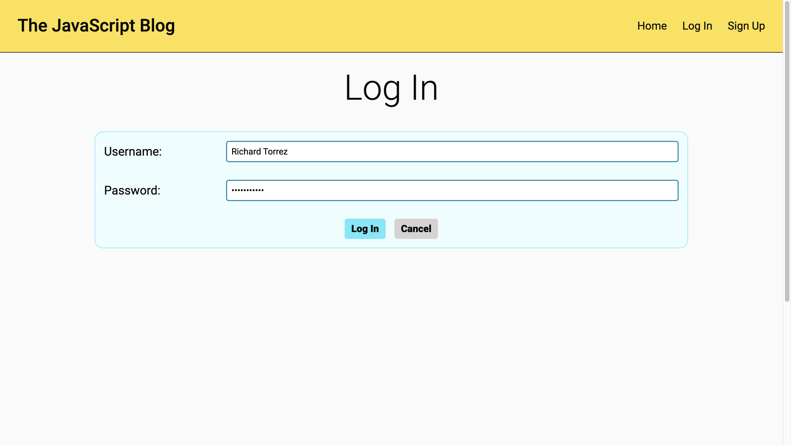
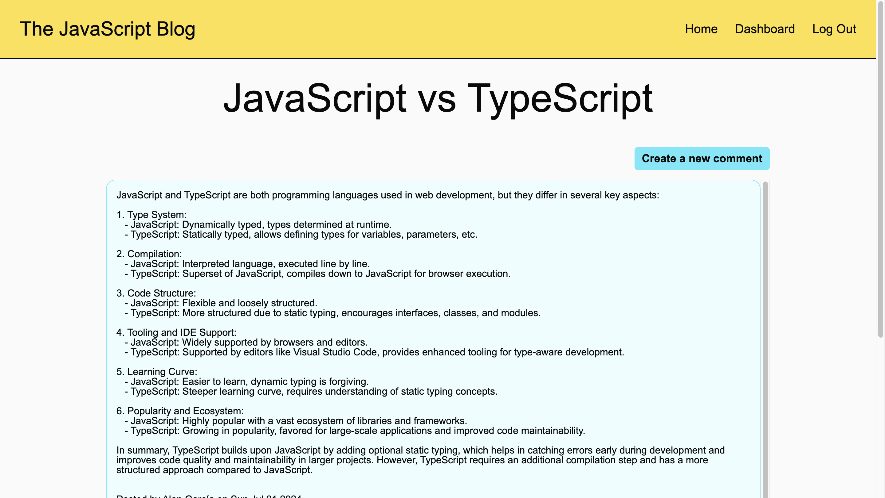
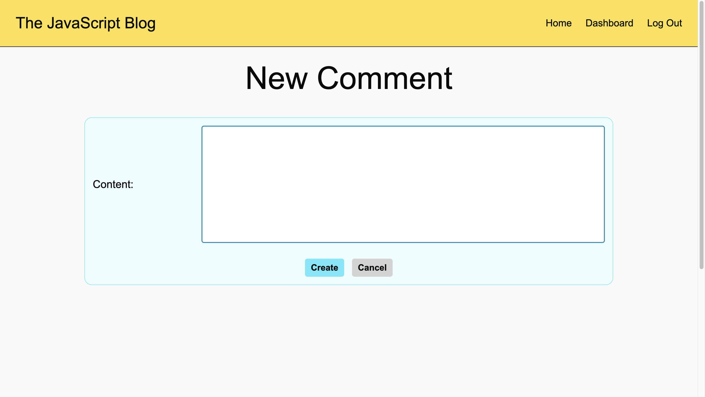
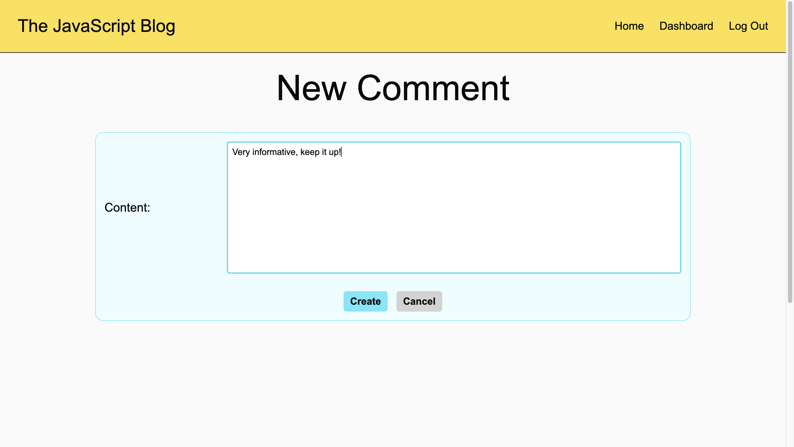
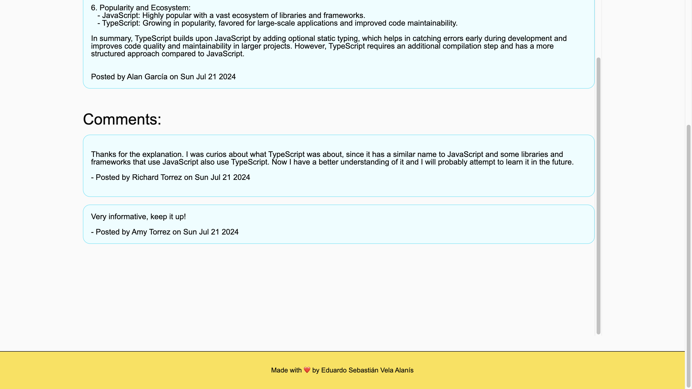

# The JavaScript Blog

## Description

The JavaScript Blog is a simple blog website were you can post about JavaScript topics, and comment on the posts of others. The reason I built this project was to practice the MVC architecture, since the project's files are divided into models, views and controllers. The models are the ones that control the shape of the data the web application handles, the views how the user interfaces of the web application will look like, and the controllers the routes and API routes that are available. During the development of this project, I learned how the different parts of a full stack web application interact with each other, and that each part is essential for it to work properly, since if the models, views or controllers of the web application are flawed, the flawed components will affect the functionality of other components an so on.

## Table of Contents

- [Installation](#installation)
- [Usage](#usage)

  - [Sign up](#sign-up)
  - [Log in](#log-in)
  - [Create a post](#creating-a-post)
  - [Modifying a post](#modifying-a-post)
  - [Deleting a post](#deleting-a-post)
  - [Creating a comment](#creating-a-comment)

- [Credits](#credits)
- [License](#license)

## Installation

No installation is required, since you can visit The JavaScript Blog by clicking the following link: https://js-blog-53vb.onrender.com

## Usage

First go to The JavaScript Blog website, to start learning how to use it, by clicking on the following link: https://js-blog-53vb.onrender.com
This link will redirect you to the homepage of The JavaScript Blog which is the following:

### Sign Up

To sign up click on the “Sign Up” button, which is located in the header. This button will redirect you to the sign up page of the website. In here you can create a new account, by entering a new username and password into the sign up form of the website and clicking its “Sign In” button. If you were signed up successfully, you will be redirected to the dashboard page of your new account.

### Log In

To log in click on the “Log In” button, which is located in the header. This button will redirect you to the log in page of the website. In here you can log in, by entering your username and password into the log in form of the website and clicking its “Log In” button. If you were logged in successfully, you will be redirected to the dashboard of your account.

### Creating a post

To create a post, you need to click on the “Create a new post” button found on the dashboard page of the website, and a form to create a new post will appear. Fill out the form with the title and content of the new post and click on its “Create” button. If the post was created successfully, you will be redirected to your dashboard with your newly created post. Your new post will also be displayed in the homepage for everyone to see.

### Modifying a post

To modify a post, you need to first select the post you want to modify, by clicking on it in your dashboard page. Then the form to modify and delete a post will appear. Modify the contents of the post and when you are done click on the “Modify” button of the form. If you didn’t see any error messages, then the post was modified successfully. To check you can just go back to your dashboard and select it again, or check if its contents changed in the homepage.

### Deleting a post

To delete a post, you need to first select the post you want to delete, by clicking on it in your dashboard page. Then the form to modify and delete a post will appear. Click on the “Delete” button of the form, and click on the “OK” button of the pop-up that follows. If the post was deleted successfully, you should have been redirected to the dashboard page, where you will no longer see the deleted post.

### Creating a comment

To create a comment select one of the posts of the homepage to go to that post’s page. Then click on the “Create a new comment” button found on it. Then fill out the form to create a new comment and click on its “Create” button, to create the comment. If the comment was created successfully, you will be redirected to the page of the post you selected, where you will find the comment you created on its comment section.

## Credits

The data of the sample posts and comments was provided by ChatGPT: https://chatgpt.com

## License

The JavaScript Blog uses the MIT license.
